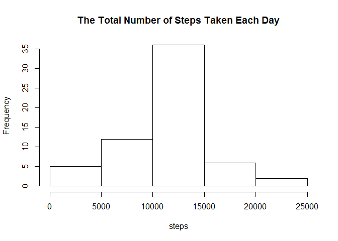

# Reproducible Research: Peer Assessment 1


### Loading and preprocessing the data


```r
Sys.setlocale("LC_ALL","English")
```

```
## [1] "LC_COLLATE=English_United States.1252;LC_CTYPE=English_United States.1252;LC_MONETARY=English_United States.1252;LC_NUMERIC=C;LC_TIME=English_United States.1252"
```

```r
library(reshape2)
library(lattice)
    
unzip("activity.zip")
act_data<-read.csv("activity.csv")
act_data$date<-as.Date(act_data$date,format="%Y-%m-%d")
```

### What is mean total number of steps taken per day?


```r
melt.data<-melt(act_data,id=c("date","interval"), measure.vars=c("steps"))
date.step<-dcast(melt.data,date ~ "steps", sum)

with(date.step,hist(steps,main="The Total Number of Steps Taken Each Day"))
```

 

```r
mean.date.step<-mean(date.step$steps,na.rm=TRUE)
med.date.step<-median(date.step$steps,na.rm=TRUE)
    
print(paste("The mean of the total number of steps taken per day is ", mean.date.step, ".", sep=""))
```

```
## [1] "The mean of the total number of steps taken per day is 10766.1886792453."
```

```r
print(paste("The median of the total number of steps taken per day is ", med.date.step, ".", sep=""))
```

```
## [1] "The median of the total number of steps taken per day is 10765."
```

### What is the average daily activity pattern?


```r
interval.step<-dcast(melt.data, interval ~ "steps", mean, na.rm=TRUE)
max.interval<-interval.step[interval.step$steps == max(interval.step[,2]),1]

with(interval.step,plot(interval,steps,type="l", main="The Average Number of Steps Taken per 5-minute Interval"))
```

 

```r
print(paste("The interval of", max.interval, "contains the max number of steps."))
```

```
## [1] "The interval of 835 contains the max number of steps."
```

```r
print(paste("The total number of missing values in the dataset is:", nrow(subset(act_data,is.na(act_data$steps)))))
```

```
## [1] "The total number of missing values in the dataset is: 2304"
```

### Imputing missing values


```r
fill_data <- merge(act_data, interval.step, by="interval", suffixes=c("", "_intervalmean"))
fill_data[is.na(fill_data$steps), "steps"] = fill_data[is.na(fill_data$steps), "steps_intervalmean"]
fill_data$steps_intervalmean <- NULL

week <- factor(weekdays(fill_data$date), c("Monday", "Tuesday", "Wednesday", "Thursday", "Friday", "Saturday", "Sunday"))
levels(week)[1:5]<-"weekday"
levels(week)[2:3]<-"weekend"
fill_data <- cbind(fill_data,week)
    
melt.fill.data<-melt(fill_data,id=c("date","interval","week"), measure.vars=c("steps"))
date.step.f<-dcast(melt.fill.data,date ~ "steps", sum)
    
with(date.step.f,hist(steps, main="The Total Number of Steps Taken Each Day"))
```

 

```r
mean.date.step.f<-mean(date.step.f$steps,na.rm=TRUE)
med.date.step.f<-median(date.step.f$steps,na.rm=TRUE)
    
print(paste("The mean of the total number of steps taken per day is ", mean.date.step.f, ".", sep=""))
```

```
## [1] "The mean of the total number of steps taken per day is 10766.1886792453."
```

```r
print(paste("The median of the total number of steps taken per day is ", med.date.step.f, ".", sep=""))
```

```
## [1] "The median of the total number of steps taken per day is 10766.1886792453."
```

### Are there differences in activity patterns between weekdays and weekends?


```r
week.interval.f<-dcast(melt.fill.data, week + interval ~ "steps", mean)
    
with(week.interval.f,xyplot(steps ~ interval | week, type="l", layout=c(1,2), xlab="Inteval", ylab="Number of Steps"))
```

 


