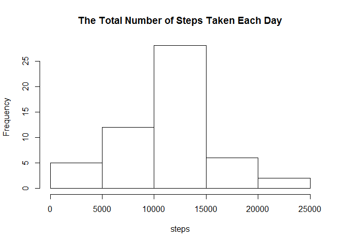
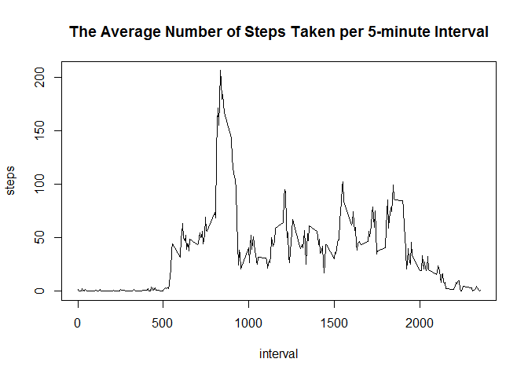
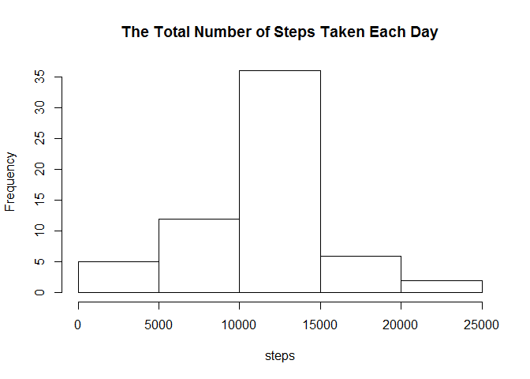
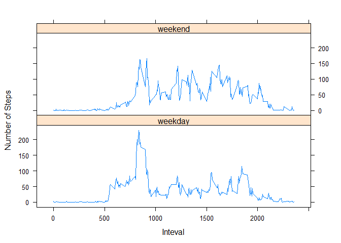

# Reproducible Research: Peer Assessment 1


## Loading and preprocessing the data


```r
Sys.setlocale("LC_ALL","English")
```

```
## [1] "LC_COLLATE=English_United States.1252;LC_CTYPE=English_United States.1252;LC_MONETARY=English_United States.1252;LC_NUMERIC=C;LC_TIME=English_United States.1252"
```

```r
library(reshape2)
library(lattice)
    
unzip("activity.zip")
act_data<-read.csv("activity.csv")
act_data$date<-as.Date(act_data$date,format="%Y-%m-%d")
```

## What is mean total number of steps taken per day?


```r
melt.data<-melt(act_data,id=c("date","interval"), measure.vars=c("steps"))
date.step<-dcast(melt.data,date ~ "steps", sum)

with(date.step,hist(steps,main="The Total Number of Steps Taken Each Day"))
```

 

```r
mean.date.step<-mean(date.step$steps,na.rm=TRUE)
med.date.step<-median(date.step$steps,na.rm=TRUE)    
```

The mean of the total number of steps taken per day is 1.0766189\times 10^{4}.

The median of the total number of steps taken per day is 10765.

## What is the average daily activity pattern?


```r
interval.step<-dcast(melt.data, interval ~ "steps", mean, na.rm=TRUE)
with(interval.step,plot(interval,steps,type="l", main="The Average Number of Steps Taken per 5-minute Interval"))
```

 


```r
max.interval<-interval.step[interval.step$steps == max(interval.step[,2]),1]
```

The interval of 835 contains the max number of steps.

## Imputing missing values

```r
missing.rows<-subset(act_data,is.na(act_data$steps))
nrow.missing<-nrow(missing.rows)
summary(as.factor(missing.rows$date))
```

```
## 2012-10-01 2012-10-08 2012-11-01 2012-11-04 2012-11-09 2012-11-10 
##        288        288        288        288        288        288 
## 2012-11-14 2012-11-30 
##        288        288
```

The total number of missing values in the dataset is: 2304.

THe missing data happens in 8 dates.

The following codes tend to imput missing value with interval mean steps.

Note the code also processes the filled data with weekday/weekend attribute for the next question.


```r
fill_data <- merge(act_data, interval.step, by="interval", suffixes=c("", "_intervalmean"))
fill_data[is.na(fill_data$steps), "steps"] = fill_data[is.na(fill_data$steps), "steps_intervalmean"]
fill_data$steps_intervalmean <- NULL

week <- factor(weekdays(fill_data$date), c("Monday", "Tuesday", "Wednesday", "Thursday", "Friday", "Saturday", "Sunday"))
levels(week)[1:5]<-"weekday"
levels(week)[2:3]<-"weekend"
fill_data <- cbind(fill_data,week)
    
melt.fill.data<-melt(fill_data,id=c("date","interval","week"), measure.vars=c("steps"))
date.step.f<-dcast(melt.fill.data,date ~ "steps", sum)
    
with(date.step.f,hist(steps, main="The Total Number of Steps Taken Each Day"))
```

 

The filled data seems increase the total frequency of steps between 10000 and 15000.


```r
mean.date.step.f<-mean(date.step.f$steps,na.rm=TRUE)
med.date.step.f<-median(date.step.f$steps,na.rm=TRUE)
```

The mean of the total number of steps taken per day is 1.0766189\times 10^{4}.

The median of the total number of steps taken per day is 1.0766189\times 10^{4}.

The mean seems remain the same as un-filled data set, but the median changed.

It could because of that the values used to fill missing data were interval mean. Therefore the mean does not changed, and the median does due to the increased number of datasets.

## Are there differences in activity patterns between weekdays and weekends?


```r
week.interval.f<-dcast(melt.fill.data, week + interval ~ "steps", mean)
    
with(week.interval.f,xyplot(steps ~ interval | week, type="l", layout=c(1,2), xlab="Inteval", ylab="Number of Steps"))
```

 
